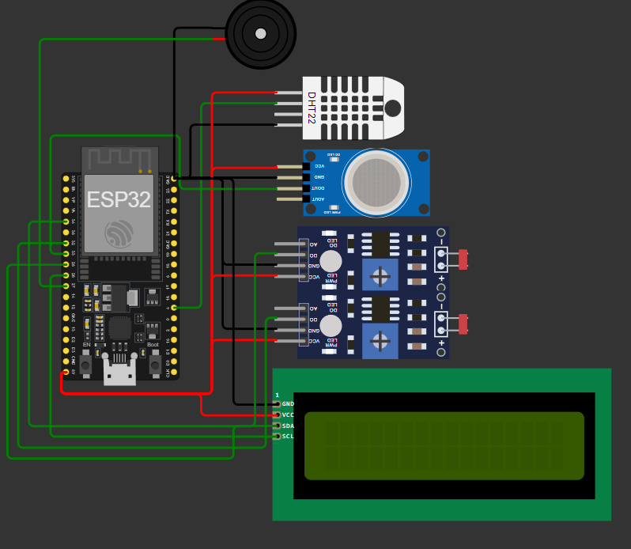
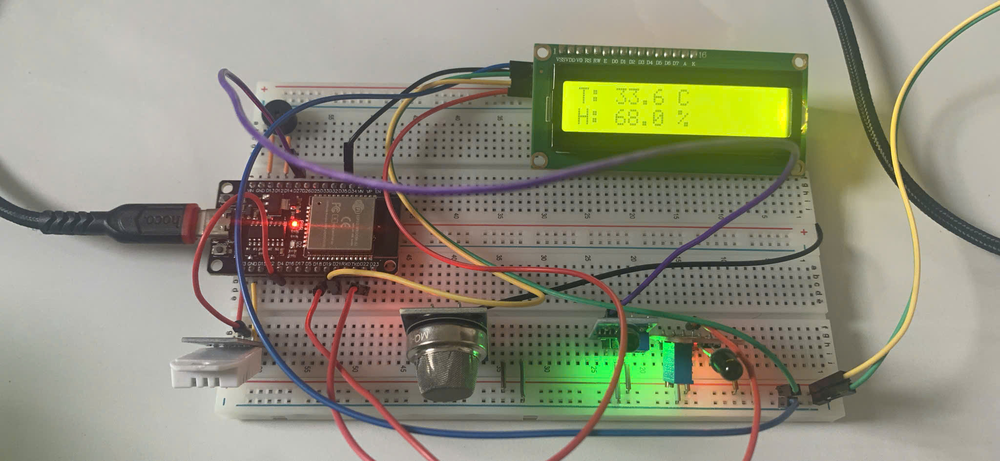

# Gas-Leak-Smoke-Detection-ESP32
This repository contains a project for a gas leak detection system and smoke/fire alarm using ESP32 and integrated with the Blynk IoT platform. The system is designed to detect hazardous gas leaks (e.g., LPG, methane) or smoke and send real-time alerts to the user through Blynk's mobile app and Telegram.

## 🔌 Wiring Connections

| **Component**          | **VCC** | **GND** | **Signal Pin(s)**            |
| ---------------------- | ------- | ------- | ---------------------------- |
| DHT22 (Temp & Humid)   | 5V      | GND     | GPIO 4 (Data)                |
| Gas Sensor (DOUT)      | 5V      | GND     | GPIO 33 (Digital Out)        |
| LDR 1 (Photoresistor)  | 5V      | GND     | GPIO 34 (DO)                 |
| LDR 2 (Photoresistor)  | 5V      | GND     | GPIO 32 (DO)                 |
| LCD1602 (I2C)          | 5V      | GND     | GPIO 25 (SDA), GPIO 26 (SCL) |
| Buzzer (Active)        | —       | GND     | GPIO 27 (Positive terminal)  |
| ESP32 ↔ Serial Monitor | —       | —       | TX → RX, RX → TX             |

---

## 📝 Notes

* All sensors are powered via the **5V** and **GND** pins of the ESP32.
* The **LCD1602** uses **I2C** protocol, so only **SDA** and **SCL** are needed.
* The **Gas Sensor** and **LDRs** use **digital outputs**, so analog reading is not required.
* The **buzzer** is **active**, so it only needs HIGH/LOW signals from GPIO 27.

---

## 📷 Simulation Circuit (Wokwi)

--- 

## 💡 Real-world Hardware Setup Changes

> ⚠️ Compared to the simulation, the following components were changed in the actual hardware implementation:

* ✅ Replaced **LDR2** with **KY-026 Flame Sensor**
* ✅ Replaced **MQ2 Gas Sensor** with **MQ5 Gas Sensor**

Photos of the real hardware setup are shown below.

## 📸 Real-world Circuit Photos

### Full Setup

---

## 🔌 Wiring Connections

| **Component**           | **VCC** | **GND** | **Signal Pin(s)**            |
| ----------------------- | ------- | ------- | ---------------------------- |
| DHT22 (Temp & Humidity) | 5V      | GND     | GPIO 4 (Data)                |
| MQ5 Gas Sensor (DOUT)   | 5V      | GND     | GPIO 33 (Digital Out)        |
| LDR 1 (Photoresistor)   | 5V      | GND     | GPIO 34 (DO)                 |
| KY-026 Flame Sensor     | 5V      | GND     | GPIO 32 (DO)                 |
| LCD1602 (I2C)           | 5V      | GND     | GPIO 25 (SDA), GPIO 26 (SCL) |
| Buzzer (Active)         | —       | GND     | GPIO 27 (Positive terminal)  |
| ESP32 ↔ Serial Monitor  | —       | —       | TX → RX, RX → TX             |

---

## ⚙️ Features

* 🌡️ **Temperature & Humidity** via DHT22
* 🔥 **Flame detection** using KY-026
* 🧪 **Gas leak detection** via MQ5
* 💡 **Light level** via photoresistor
* 📟 **Live display** on LCD1602
* 🔊 **Buzzer alert** for critical readings

